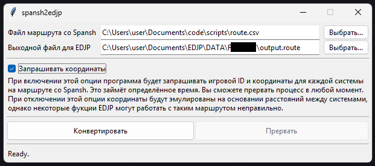

# spansh2edjp

Берёт CSV-файл маршрута, скачанный со Spansh, конвернтирует его в формат маршрута EDJP. Всё просто.

### Интерфейс


### О координатах систем

Маршрутные CSV Spansh-а содержат крайне мало информации о системах на пути, что недостаточно для полноценного заполнения маршрутного файла EDJP. Приложение предложит вам запросить недостающую информацию с серверов Spansh. Учтите, что это достаточно времязатратный процесс, поскольку Spansh не любит множественные запросы к своему API, и я ограничиваю скорость одной системой в секунду максимум, плюс время на собственно выполнение запроса, плюс трёхсекундное ожидание в случае неудачного запроса перед повторной попыткой. Эти значения взяты из головы и не подлежат настройке в приложении без редактирования исходного кода.
Вы можете отключить эту функцию. В таком случае приложение сгенерирует подставные координаты, сохраняя настоящие расстояния между системами. Учтите, что некоторые функции EDJP в таком случае могут работать некорректно; на следование маршруту, впрочем, это повлиять не должно.

### Запуск и сборка

Для запуска исполняемого файла никакие дополнительные условия не требуются.
Для запуска из исходного кода:
```bash
pip install -r requirements.txt
python spansh2edjp.py
```
Для сборки исполняемого файла из исходного кода:
```bash
pip isntall -r requirements-dev.txt
python -m nuitka spansh2edjp.py
```
`requirements-dev.txt`, помимо `nuitka`, содержит зависимости от линтеров, использующихся при разработке. При нежелании их устанавливайтесь ограничьтесь `pip install nuitka[onefile]`.

Проект писался и тестировался на Python 3.13, но в теории должен работать и на более старых версиях начиная с 3.9.
